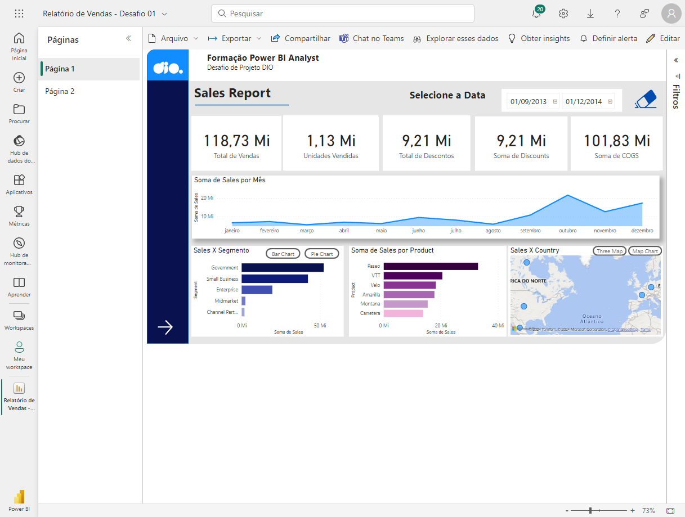

<h1 align="center">Relatório de Finanças com Power BI</h1>

O projeto consiste na criação de um relatório de Finanças na qual o usuário consiga interagir com os diversos campos utilizados na criação do mesmo.

## Súmario

- [✨ Features](#features)
- [🏆 Sobre](#sobre)

<h2 id="features">✨ Features </h2>

- Power BI
- Excel

<h2 id="sobre">🏆 Sobre</h2>

Como desafio criamos uma navegação entre as páginas e elaboramos duas páginas de relatório dinâmicas utilizando o Power BI, para a criação da segunda página eu optei por utilizar dois visuais adionais disponibilizados nas extensões, sendo eles o Radar Chart e Chiclet Slicer, todos os demais gráficos foram utilizados com os recursos bases do Power BI.